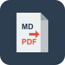
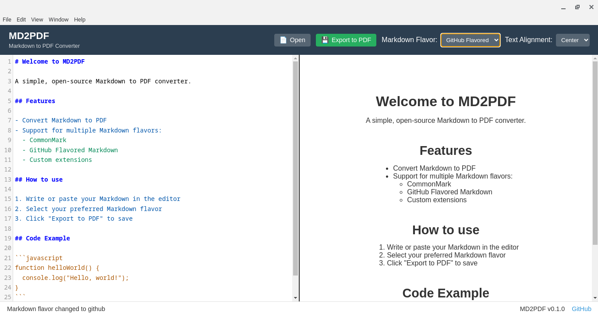

# MD2PDF



An open-source Markdown to PDF converter with support for multiple Markdown flavors.

[](https://opensource.org/licenses/MIT)
[](https://github.com/Rmiddaugh10/md2pdf/releases)

## Overview

MD2PDF is a desktop application that simplifies the process of converting Markdown documents to professionally formatted PDF files. The application supports multiple Markdown flavors and provides a live preview, allowing you to see your document exactly as it will appear in the exported PDF.



## Key Features

- **Multiple Markdown Flavors**: Support for CommonMark, GitHub Flavored Markdown, and custom extensions
- **Live Preview**: Real-time preview of your Markdown as you type
- **Syntax Highlighting**: Code blocks are highlighted using highlight.js
- **Customizable Styling**: PDF output can be styled with custom CSS
- **Cross-Platform**: Works on Windows, macOS, and Linux
- **User-Friendly Interface**: Intuitive split-screen layout with editor and preview panes

## Installation

### Download Pre-built Binaries

Pre-built binaries for Windows, macOS, and Linux are available on the [Releases](https://github.com/Rmiddaugh10/md2pdf/releases) page.

- **Windows**: Download and run the `.exe` installer
- **macOS**: Download the `.dmg` file, open it, and drag the application to your Applications folder
- **Linux**: Download the `.AppImage` or `.deb` package depending on your distribution

### Build from Source

#### Prerequisites

- [Node.js](https://nodejs.org/) (v14 or higher)
- npm (included with Node.js)

#### Clone and Install

1. Clone the repository:
   ```
   git clone https://github.com/yourusername/md2pdf.git
   cd md2pdf
   ```

2. Install dependencies:
   ```
   npm install
   ```

3. Start the application in development mode:
   ```
   npm run dev
   ```

4. Build distributable packages:
   ```
   npm run build
   ```

## Usage Guide

### Basic Operations

1. **Open a Markdown File**: Click the "Open" button to load an existing Markdown file
2. **Edit Your Markdown**: Use the editor on the left side to write or edit your Markdown
3. **Choose a Markdown Flavor**: Select your preferred Markdown flavor from the dropdown menu
4. **Export to PDF**: Click the "Export to PDF" button to save your document as a PDF

### Markdown Flavors

#### CommonMark

Basic Markdown standard with support for:
- Headers
- Lists (ordered and unordered)
- Links and images
- Bold and italic text
- Code blocks
- Blockquotes
- Horizontal rules

#### GitHub Flavored Markdown (GFM)

Extends CommonMark with:
- Tables
- Task lists
- Strikethrough
- Automatic URL linking
- Syntax highlighting for code blocks

#### Custom Flavor

The custom flavor allows for additional extensions:
- Math expressions using TeX syntax
- Custom block syntax
- Additional parsing rules

## Development

### Project Structure

```
md2pdf/
├── src/
│   ├── index.js                  # Main entry point
│   ├── parser/
│   │   ├── index.js              # Parser factory
│   │   ├── commonmark.js         # CommonMark parser
│   │   ├── github.js             # GitHub Flavored Markdown parser
│   │   └── custom.js             # Custom flavor parser
│   ├── renderer/
│   │   ├── index.js              # Renderer factory
│   │   └── pdfRenderer.js        # PDF rendering logic
│   └── ui/
│       ├── index.js              # UI initialization
│       ├── components/           # UI components
│       └── styles/               # CSS styles
├── public/
│   ├── index.html                # Main HTML file
│   └── assets/                   # Images, icons, etc.
├── build/
│   └── icons/                    # Application icons
├── package.json                  # Dependencies and scripts
├── README.md                     # Project documentation
└── LICENSE                       # MIT License
```

### Building for Different Platforms

The project includes scripts for building platform-specific packages:

```
npm run build:mac    # Build macOS package
npm run build:win    # Build Windows package
npm run build:linux  # Build Linux package
```

### Running Tests

Run the test suite with:

```
npm test
```

## Extending the Application

### Adding a New Markdown Flavor

1. Create a new parser implementation in `src/parser/`
2. Update the parser factory in `src/parser/index.js`

### Adding a New Output Format

1. Create a new renderer in `src/renderer/`
2. Update the renderer factory in `src/renderer/index.js`

## Roadmap

Future enhancements planned for MD2PDF:

- Custom CSS editor for styling PDF output
- Template system for common document formats
- Document outline/navigation panel
- Export to additional formats (HTML, DOCX)
- Spellchecking and grammar checking
- Improved math rendering
- Diagram support (mermaid, PlantUML)

## Contributing

Contributions are welcome! Please see [CONTRIBUTING.md](CONTRIBUTING.md) for details on how to contribute to this project.

## License

This project is licensed under the MIT License - see the [LICENSE](LICENSE) file for details.

## Acknowledgments

- [marked](https://github.com/markedjs/marked) - Markdown parser
- [highlight.js](https://github.com/highlightjs/highlight.js) - Syntax highlighting
- [html-pdf-node](https://github.com/mrafiqk/html-pdf-node) - HTML to PDF conversion
- [CodeMirror](https://codemirror.net/) - Text editor implementation
- [Electron](https://www.electronjs.org/) - Framework for building desktop applications

---

<p align="center">
  Made with ❤️ by <a href="https://github.com/Rmiddaugh10">Robert</a>
</p>
